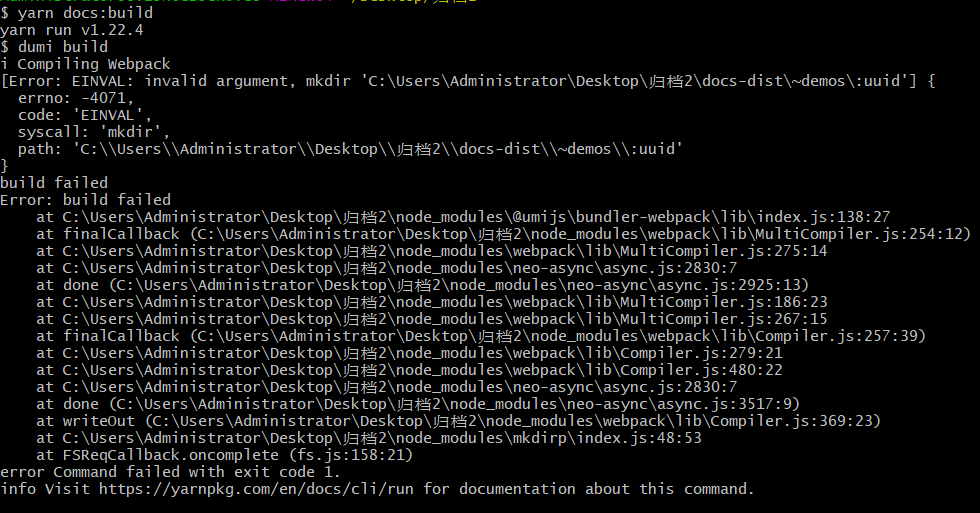

# 🌟 umi-win-exportStatic

利用 GitHub Actions 规避 umi 在 windows 环境下开启 exportStatic 打包问题

## 现象描述

当 config 设置 exportStatic 时，windows 环境下 docs:build 会出现如下问题

- 原因为：现不支持 windows 动态路由。Mac、Linux 下正常。

## 解决方案

### 1. `.gitignore`

去掉或注释 doc 打包生成路径 `/docs-dist`

### 2. 复制 `.github/workflows/build.yml`

在自己的项目中新建 Actions，内容可复制该项目内容。

### 3. 提交代码触发 Actions

### 4. 系统自动打包并提交代码

### 5. 下载最新代码，获取打包后结果
